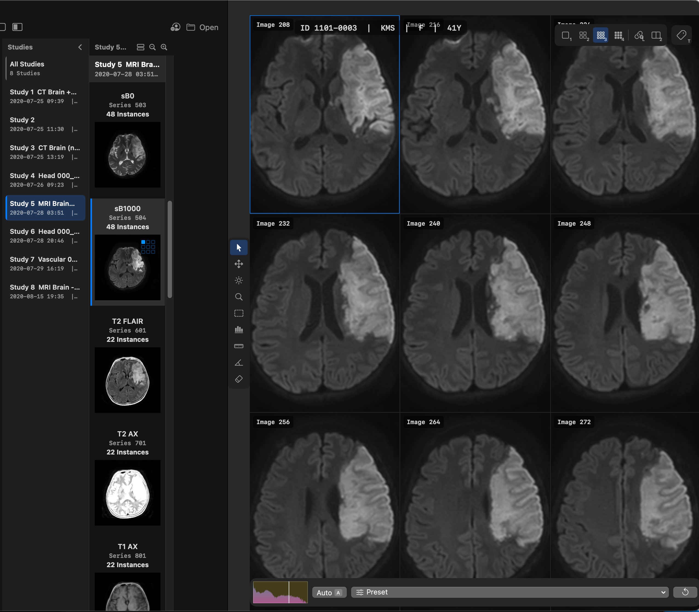

# Smart DICOM Viewer

Smart DICOM Viewer is a native macOS DICOM viewer for fast image loading, multi-panel comparison, MPR/MIP review, Window/Level adjustment, measurements, and DICOM tag inspection.

## Download

- Latest DMG: [Smart-DICOM-Viewer.dmg](https://github.com/brainok/smart-dicom-viewer-release/releases/latest/download/Smart-DICOM-Viewer.dmg)
- Release repository: [brainok/smart-dicom-viewer-release](https://github.com/brainok/smart-dicom-viewer-release)
- Source repository: [brainok/smart-dicom-viewer](https://github.com/brainok/smart-dicom-viewer)

## Installation

1. Download the latest DMG.
2. Open the DMG and drag `Smart DICOM Viewer.app` to `Applications`.
3. Launch the app.

The current distribution build is signed with Developer ID and notarized by Apple.

## License Activation

- The app includes a 30-day full-feature trial.
- After the trial period, Brainok license activation is required.
- Open `Smart DICOM Viewer` -> `Activate License...` to activate a license code.
- The first activation requires an internet connection.
- Activation data is stored in the macOS Keychain. After activation, the app can be used offline.

## Features

- Fast DICOM scanning and first-image display
- Single, side-by-side, stacked, and quad multi-panel layouts
- Synchronized scrolling and zoom across panels
- MPR, MIP, MinIP, and Average volume views
- Window/Level tool, auto W/L, and ROI-based W/L
- Distance, angle, and ROI statistics measurements
- Cross-reference lines between panels
- DICOM tag inspector
- Cursor coordinates and HU value readout
- Scrollbar thumbnail preview
- JPEG 2000 compressed DICOM support through DCMTK and OpenJPEG
- DICOM folder anonymization

## Basic Use

- Open files: `File` -> `Open...` or `Cmd+O`
- Open DICOM files/folders: drag them from Finder into the app window
- Activate a panel: click the panel
- Toggle panel fullscreen: double-click the panel
- Show DICOM tags: `T`
- Toggle synchronized scroll/zoom: `L`
- Toggle cross-reference lines: `X`
- Anonymize a folder: `File` -> `Anonymize Folder...` or `Cmd+Shift+A`

## Keyboard Shortcuts

Navigation:

- `Up` / `Down`: previous/next image in the current series
- `Left` / `Right`: previous/next series
- `Scroll`: navigate slices
- `Page Up` / `Page Down`: skip 10 images
- `Home` / `End`: jump to first/last image
- `Tab`: cycle the active panel

Layout:

- `1` / `2` / `3` / `4`: single, side-by-side, stacked, and quad layouts
- `Cmd+1` - `Cmd+4`: menu-based layout switching
- `Cmd+Shift+M`: MPR layout
- `Cmd+Shift+L`: toggle linked panels

Tools:

- `V`: Select
- `P`: Pan
- `W`: Window/Level
- `Z`: Zoom
- `O`: ROI Window/Level
- `S`: ROI Statistics
- `D`: Ruler
- `N`: Angle
- `E`: Eraser

Display:

- `A`: Auto Window/Level
- `I`: Invert image
- `F`: Fit to window
- `R`: Reset view
- `H`: Flip horizontal
- `]` or `.`: rotate 90 degrees clockwise
- `[` or `,`: rotate 90 degrees counter-clockwise

Mouse:

- Left-click: activate panel or use the selected tool
- Right-drag: adjust Window/Level
- Scroll wheel: navigate slices
- `Option` or `Control` + left-drag: pan
- `Option` or `Control` + scroll: zoom
- `Shift` + click: toggle panel group selection
- Drag from Finder or the sidebar: assign a series to a panel

## Development

Requirements:

- macOS 14.0 Sonoma or later
- Xcode 15 or later, or Swift 5.9 or later
- Apple Silicon Mac, arm64 build target

Core pieces:

- `SimpleDICOM.swift`: fast tag reading and metadata parsing
- `DCMTKWrapper`: decoding for complex transfer syntaxes and compressed pixel data
- `DICOMModel.swift`: series loading, cache management, and panel coordination
- `PanelState.swift`: per-panel W/L, zoom, tool, and metadata state
- `MPREngine.swift` and `MetalVolumeRenderer.swift`: MPR and volume rendering
- `LicenseManager.swift`: 30-day trial, Brainok activation, and Keychain storage

## License

The source code is licensed under the [MIT License](LICENSE). The distributed app uses Brainok license activation after the 30-day trial.

DCMTK is licensed under the BSD license. OpenJPEG is licensed under BSD-2-Clause. See [THIRD_PARTY_LICENSES.md](THIRD_PARTY_LICENSES.md) for details.

## About

This application is a fork of the open-source DICOM Web Viewer (DWV) project developed by Ivan Martel. The original source code is available at  DWV GitHub Repository⁠. The application has been extensively customized and enhanced by Prof. JoonNyung Heo, Yonsei University College of Medicine, to support additional features and workflows for research and clinical use.  

https://github.com/ivmartel/dwv

Made by Hyo Suk Nam

- Email: [brainok777@gmail.com](mailto:brainok777@gmail.com)
- Store: [https://store.brainok.net](https://store.brainok.net)
